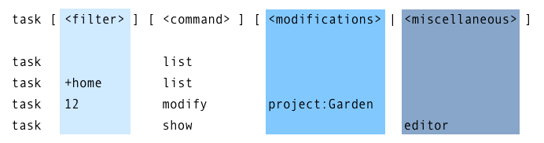

# Taskwarrior

Install:

```shell
sudo pacman -S task
```

Basic:

```shell
# add a task
task add {things}

# list tasks
task ls
task next
task # euqal to task next

# task is done
task {num} done
```

## Basic configuration

all the configuration is in `.taskrc`

### Config Command

`config` command can be used to modify `.taskrc` file.

```shell
task config regex on
```

### Show command

`show` command will show all the current configuration settings. Also it will filter by a keyword like this.

```shell
task show report.minimal
```

### Include

make our setting nested

```shell
include [xxxx]
include ~/themes/solarized-dark-256.theme
```

### temporailly override

`config` command makes permanent changes. we can use following command to make change temporarily

```shell
task rc.regex=on /[Tt]otal/ list
task rc.data.location=/alternate/path/.task ...
```

## Command Line Syntax

```shell
task [<filter>] [<command>] [<modifications>|<miscellaneous>]
```



### modifications

一般来说支持 修改的命令一般都支持 filter.如果 filter item 不止一个，则关系为 `and`

```shell
task +home status:pending modify priority:H due:eom
```

这里filter 表示 含有 `home` 的tag,同时 `status` 为 pending 的任务。将被修改

## tips -- add more context and metadata

- assign a **project** to your task

```shell
task ID modify project:{xxx}
```

- assign **due** date

```shell
task ID modify due:31st
```

- if working on a task, mark it **start**

```shell
task ID start
```

- if we konw the **priority** of a task, add it. But don't modify it too often

```shell
task ID modify priority:M
```

- add useful **tags**, which is useful to filter

```shell
task ID modify +problem +house
```

**to boost it urgency**, add tag `next`

```shell
task ID modify +next
```

- add dependencies of the task

```shell
task ID modify depends:{OTHER_ID}
```

all these thing can be used in `add`

```shell
task add project:Kitchen Select floor tiles
task add project:Kitchen Measure counter-top
task add project:Kitchen Design placement of electrical outlets
task add project:Kitchen Locate ideal placement for extractor duct
```

### remove the metadata of a task

```shell
task ID modify due:
```

## Advanced

### Filter

[Advanced Filters](https://taskwarrior.org/docs/examples/#filters)

### Project

use a project hierarchy

```shell
task add project:Home.Kitchen Clean the floor
task add project:Home.Kitchen Replace broken light bulb
task add project:Home.Garden Plant the bulbs
task project:Home.Kitchen count
2
task project:Home.Garden count
1
task project:Home count
3
```

check what project current used

```cpp
task projects
```

## Wordflow

[web](https://taskwarrior.org/docs/workflow/)

## Taskwirror-tui

overall

```txt
Esc:                                 - Exit current action

]: Next view                         - Go to next view

[: Previous view                     - Go to previous view
```

help : `?`
